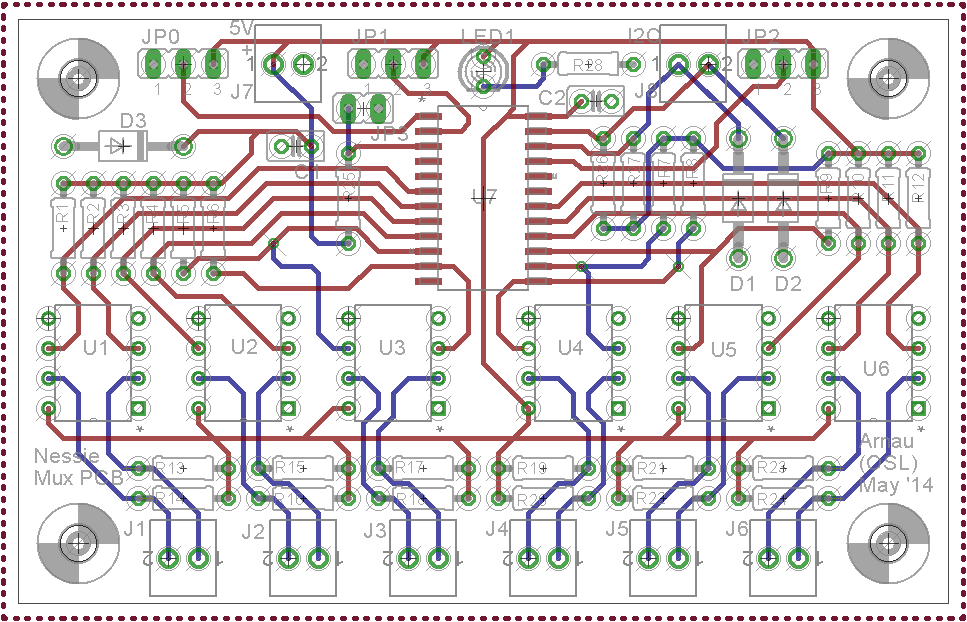

OSL MUX Board
=============

The __OSL MUX board__ is a small standalone 2-layer pcb design for providing I2C multiplexing capabilities to embedded boards (like the Arduino platform) often used in small robotics projects.

This board has been design to be used in motor control problems for a robotic platform using I2C thrusters. This design is using I2C bus extenders to allow operations over longer connections. The following layout ([eagle file](mux_board_final.sch)) is taken as reference where the I2C multiplexer chip of choice is an NXP PCA9547D 8 channel one. This solution can be used with its sister project the __[OSL I2C Buff Board](https://github.com/decabyte/osl_buff_board)__.

The main features are the availability up to 6 multiplexed channels with bus extender output, the presence of TVS protection diodes on the +5V volts and I2C input lines, the address selection jumper headers, the presence of pull-up +5V resistors. The design offers also a reset jumper header and a power-on LED indicator. This solution can be easily modified if the bus extenders are not needed by simply bypassing their connections. If +3.3V or different pull-up voltages are needed the correspondant resistors must be left out and the pull-up function has to be provided externally. This board has been designed together with Arnau Puig Mensa.

### Components

* 1 x NXP PCA9547D I2C multiplexer (8 ch)
* 6 x NXP P82B715PN I2C bus extender
* 3 x SA5.0A 5.0V TVS protection diodes

For a more detailed list look at [the bill of materials](docs/BOM) in the [docs](docs) dir.

## References

* [NXP PCA9547D](http://www.nxp.com/products/interface_and_connectivity/i2c/i2c_multiplexers_switches/series/PCA9547.html)
* [NXP P82B715PN](http://www.nxp.com/products/interface_and_connectivity/i2c/i2c_bus_repeaters_hubs_extenders/P82B715PN.html)
* [Arduino WireLibrary Details](http://playground.arduino.cc/Main/WireLibraryDetailedReference)

## LICENSE - "MIT License"

Copyright (c) 2013-2014 Valerio De Carolis, http://decabyte.it

Permission is hereby granted, free of charge, to any person
obtaining a copy of this software and associated documentation
files (the "Software"), to deal in the Software without
restriction, including without limitation the rights to use,
copy, modify, merge, publish, distribute, sublicense, and/or sell
copies of the Software, and to permit persons to whom the
Software is furnished to do so, subject to the following
conditions:

The above copyright notice and this permission notice shall be
included in all copies or substantial portions of the Software.

THE SOFTWARE IS PROVIDED "AS IS", WITHOUT WARRANTY OF ANY KIND,
EXPRESS OR IMPLIED, INCLUDING BUT NOT LIMITED TO THE WARRANTIES
OF MERCHANTABILITY, FITNESS FOR A PARTICULAR PURPOSE AND
NONINFRINGEMENT. IN NO EVENT SHALL THE AUTHORS OR COPYRIGHT
HOLDERS BE LIABLE FOR ANY CLAIM, DAMAGES OR OTHER LIABILITY,
WHETHER IN AN ACTION OF CONTRACT, TORT OR OTHERWISE, ARISING
FROM, OUT OF OR IN CONNECTION WITH THE SOFTWARE OR THE USE OR
OTHER DEALINGS IN THE SOFTWARE.
